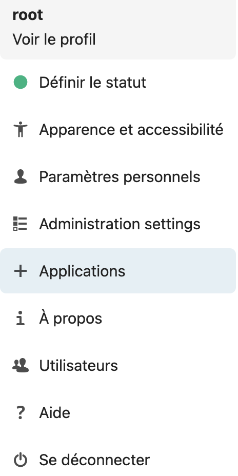
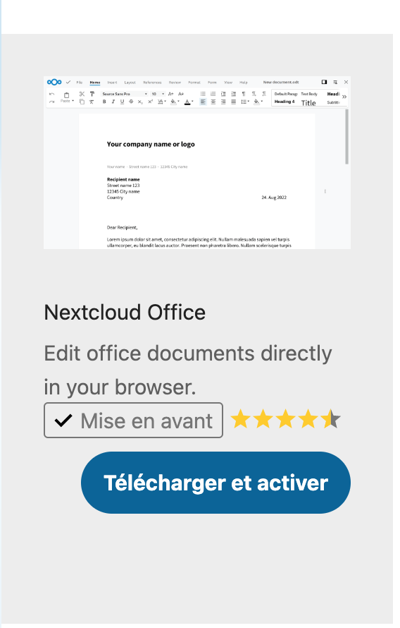
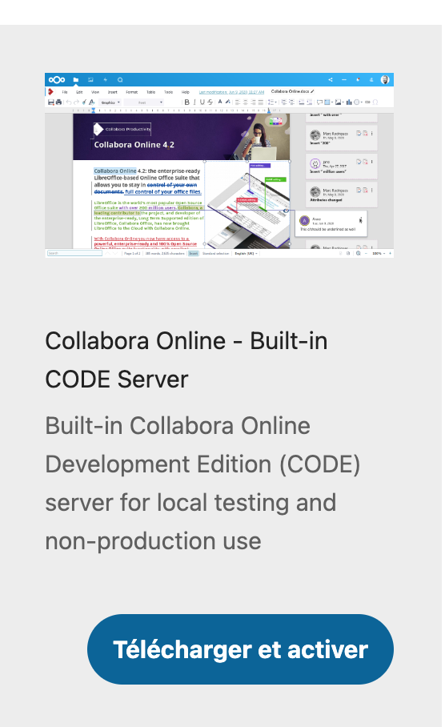
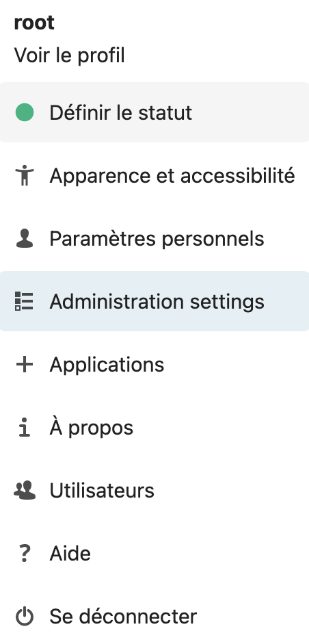
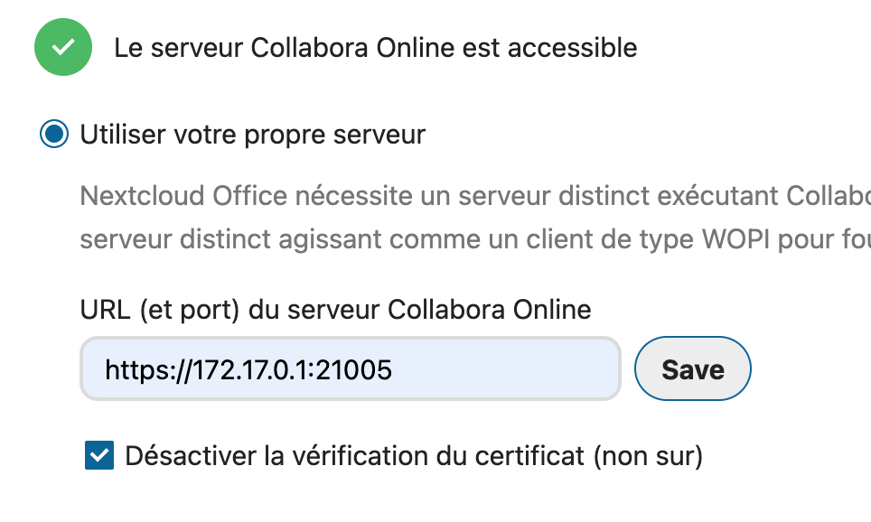

# Nextcloud CI/CD pipeline

Deploy Nextcloud with CI/CD on Elestio

 
 

# Once deployed ...

You can can open Nextcloud here:

    URL: https://[CI_CD_DOMAIN]
    Login: root
    password: [ADMIN_PASSWORD]

## Configuring Collabora

### 1.

On your NextCloud dashboard, click your user icon in the top right corner, and select Apps from the drop-down list.
Navigate to the Office & Text apps section.

Find the Nextcloud Office App, download and enable it.

Find the Collabora Online App, download and enable it.

### 2.

Access your user icon, and select Settings from the drop-down list.

On the left navigation bar, click Nextcloud Office under the Administration section.

Toggle Use your own server, enter

        https://[CI_CD_DOMAIN]:21005

and click Save. You should receive a server reachable alert.

Scroll to Advanced settings and set your preferred default file type for documents, to work well with Microsoft Office products, use Office Open XML (OOXML). To automatically watermark documents, enable watermarking under Secure view settings.

Navigate to Files.
Click create new + to upload supported files, or choose between text, word document, spreadsheet, or presentation files to create.
